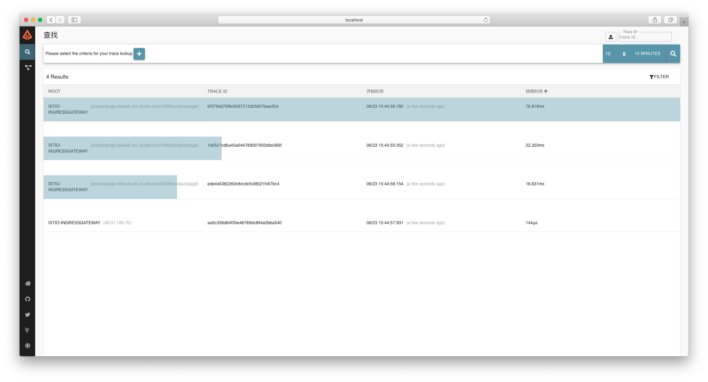
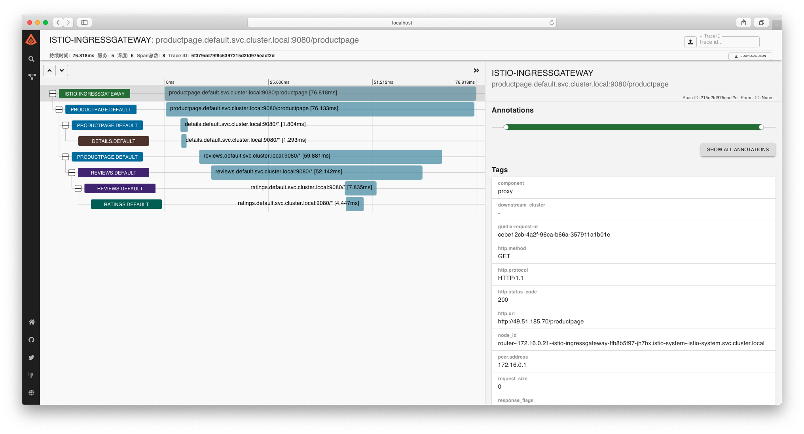

# Zipkin
Zipkin 是一个分布式跟踪系统，它有助于收集服务的调用关系和服务的调用时序数据，包括收集数据和结果展示。它基于 Google Dapper 论文的设计，由 Twitter 实现并基于 Apache 2.0 协议开源。

## 追踪原理
在分布式系统架构中，用户的一次请求，往往需要经过不同的服务和模块，才能够最终返回请求结果。不同的“微服务”之间，每次调用都会形成一个完整的调用链，组成一个树状结构。


这一颗完整的树，我们称为 `Trace`， 树里的每一个节点，我们称之为 `Span` 。当服务被调用的时候，都会为 `Trace` 和 `Span` 生成唯一的 `ID` 标识，通过记录调用发起方 `parentId` ，我们就可以很清晰的将每一个 `Span` 串联起来，形成一条完整的调用链，这是分布式调用链追踪的基本原理。

当然，Zipkin 兼容 `OpenTracing` 协议，所以 `Span` 还会记录其他的信息，例如：时间戳、span 上下文、以及额外的 K/V tag 等。

## Envoy-Zipkin 架构
在 `Istio` 中，`Envoy` 原生支持分布式追踪系统 Zipkin。当请求通过 `Envoy` Sidecar 流量拦截时，`Envoy` 会自动为 HTTP Headers 添加 `x-b3` 开头的 Headers 和 `x-request-id`，此 Headers 在不同的服务调用时需要由业务逻辑负责传递，最终通过 `Envoy` 上报给 `Zipkin` 解析出完整的调用链。

详细的过程大致为：
* 如果来源请求没有 Trace 相关的 Headers，则会在流量进入 POD 之前创建一个 Root Span。
* 如果来源请求包含 Trace 相关的 Headers，Envoy 将会解析 Span 上下文信息，然后在流量进入 POD 之前创建一个新的 Span 继承自旧的 Span 上下文。


在 Istio 服务网格内，调用链的 `Span` 信息由 `Envoy` 通过 proxy 直接上报给 `zipkinServer`，服务和 `Zipkin` 的调用流程以及 Zipkin 内部结构大致如下：


* 传输层：默认为 HTTP 的方式，当然还可以使用 Kafka、Scribe 的方式。
* 收集器（Collector）：收集过来的 span 数据，并进行数据验证、存储以及创建必要的索引。
* 存储（storage）：默认是 in-memory 的方式，用于测试，请注意此方式追踪数据并不会被持久化，其他可选方式有 JDBC（Mysql）、Cassandra、Elasticsearch 。
* API：提供 API 外部调用查询，主要提供 Web UI 调用。
* User Interfaces（Web UI）：提供追踪数据查询的 Web UI 界面展示。

以 Bookinfo 为例，通过分析 `productpage` Python 服务，可以发现代码里使用了 `OpenTracing` 库从 HTTP Headers 内提取了所需的 Headers，并在调用下游服务时，附带这些 Headers 数据。
```
def getForwardHeaders(request):
    headers = {}
    # x-b3-*** headers can be populated using the opentracing span
    span = get_current_span()
    carrier = {}
    tracer.inject(
        span_context=span.context,
        format=Format.HTTP_HEADERS,
        carrier=carrier)

    headers.update(carrier)
    # ...
    incoming_headers = ['x-request-id']
    # ...
    for ihdr in incoming_headers:
        val = request.headers.get(ihdr)
        if val is not None:
            headers[ihdr] = val
    return headers
```

## 环境准备
请先按照本书指引部署 `Bookinfo` 示例应用程序，然后进行以下配置：

1. 打开 tracing ，并配置 provider 为 zipkin
    ```
    $ istioctl manifest apply --set profile=demo --set values.tracing.enabled=true --set values.tracing.provider=zipkin
    ```
    此命令会在 `istio-system` 命名空间部署名为 `istio-tracing` 的 deployment，使用的镜像为 `zipkin-slim`，并为 `Envoy` 配置 Zipkin Server 。
    > 注意，默认采样率为 1%，你可以通过 `--set values.pilot.traceSampling=<Value>` 来配置采样率。Value 范围在 0.0 到 100.0 之间，精度为 0.01 。例如，Value 配置 0.01 意味着 10000 请求中跟踪 1 个请求。

2. 如果你的集群已部署 Zipkin ，你可以直接使用以下命令进行配置：
    ```
    --set values.global.tracer.zipkin.address=<zipkin-collector-service>.<zipkin-collector-namespace>:9411
    ```

3. 访问 Bookinfo `/productpage` 页面以便生成并上报追踪数据，默认 1% 的采样率意味着需要至少请求 100 次才能看到追踪数据。
    ```
    for i in `seq 1 100`; do curl -s -o /dev/null http://$GATEWAY_URL/productpage; done
    ```
    命令执行完成后，Zipkin 已经能够查询到追踪数据了。


## 访问 Zipkin Dashboard
Zipkin 作为 Istio 的插件，可以通过配置 Ingress Gateway 来进行访问，可参考官方文档获取配置信息：[https://istio.io/latest/docs/tasks/observability/gateways/](https://istio.io/latest/docs/tasks/observability/gateways/)，本文不再赘述。

如果 Istio 部署在本地环境，可以使用以下命令配置端口转发：
```
$ istioctl dashboard zipkin
http://localhost:39877
open http://localhost:39877 in your browser.
```
此命令会随机使用一个端口作为请求端口。

也可以使用 kubectl 配置端口转发：
```
$ kubectl port-forward svc/tracing 8080:80 -n istio-system
```
如使用 kubectl 配置端口转发后，打开浏览器访问 `http://localhost:8080`，即可访问 Zipkin Dashboard。


点击“搜索”图标后，出现追踪数据，点击列表数据进入追踪数据详情：


从追踪数据可以得出，访问一次 Bookinfo，涉及到了 5 个服务，Span 总数为 8 ，同时记录了请求的 TraceID 、每个服务的请求耗时以及请求总耗时。

有了 Zipkin，我们能够非常清晰地看到每一个服务的依赖，以及每次请求的时序数据，为我们在庞大的微服务系统里排查延迟问题、调用链关系等提供了极大的便利。

## 参考
* [Envoy - 追踪](https://www.servicemesher.com/envoy/intro/arch_overview/tracing.html)
* [Zipkin - Architecture](https://zipkin.io/pages/architecture.html)
* [Istio - Distributed-tracing](https://istio.io/latest/docs/tasks/observability/distributed-tracing/overview/)
* [Istio - Zipkin](https://istio.io/latest/docs/tasks/observability/distributed-tracing/zipkin/)
* [分布式集群环境下调用链路追踪](https://www.ibm.com/developerworks/cn/web/wa-distributed-systems-request-tracing/index.html)
* [Distributed Tracing, Istio and Your Applications](https://thenewstack.io/distributed-tracing-Istio-and-your-applications/)